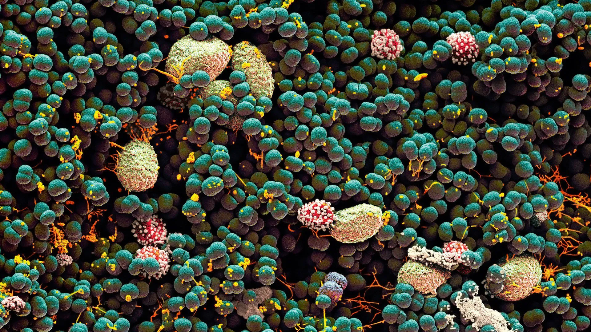

# Belly Button Biodiversity

In this work , I built an interactive dashboard to explore the [Belly Button Biodiversity dataset](http://robdunnlab.com/projects/belly-button-biodiversity/), which catalogs the microbes that colonize human navels.
The dataset reveals that a small handful of microbial species (also called operational taxonomic units, or OTUs, in the study) were present in more than 70% of people, while the rest were relatively rare.

Click on the link below to see the final dashboard which includes a gauge chart, bubble chart, horizontal bar chart, and a summary of the metadata for the human that the sample came from.

https://kwassi09.github.io/Belly_Button_Biodiversity/

 

## Tools
These are the tools, techniques, and resources used for this work.

* HTML is used for the framework of the page
* Plotly is used in combination with D3 and Javascript to generate the plots
* The data is stored in JSON format and imported in the script
* Github Pages is used to host the data and final application

